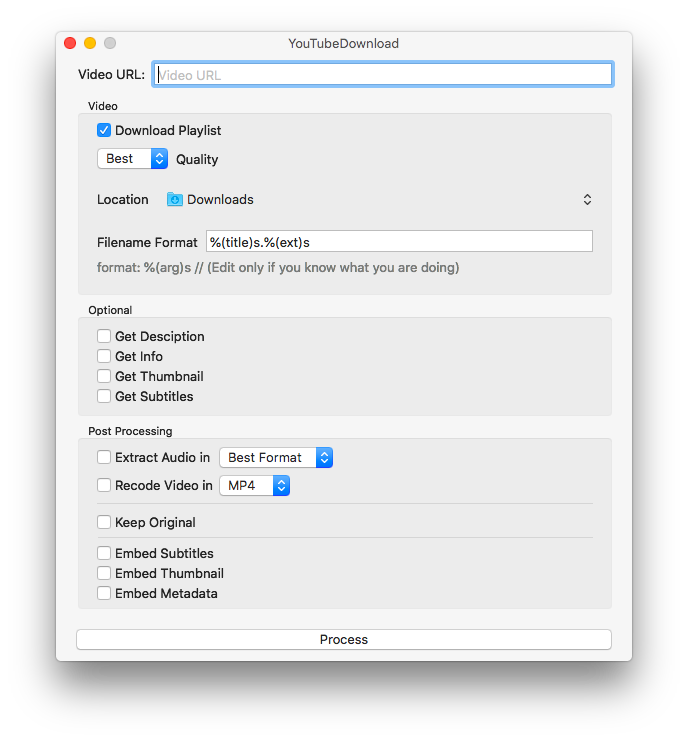

#  YouTubeDownload

YoutubeDownload is an GUI for the Command Line Application "youtube-dl"

## Dependencies
- youtube-dl  
Install it with `brew install youtube-dl`
- ffmpeg  
Install it with `brew install ffmpeg`

## Screenshots

### Light

### Dark

## Update 1.1.2
- Added GUI for Download Process
- Added Website

## Update 1.1.1
- Fixed an Issue
- Output View for Command Line Output
- Localized in German and English

## Update 1.1
- Now supports Dark Mode in macOS Mojave
